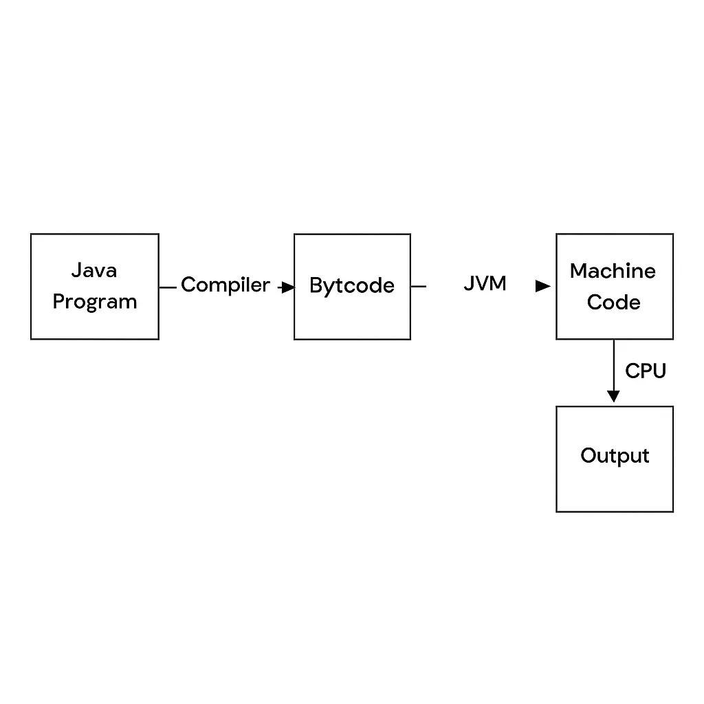

 **JDK, JRE , JVM**
 
**JVM (Java Virtual Machine)**

 - The runtime engine that actually executes bytecode.
 - Platform-specific (different JVM builds for Windows/Linux/Mac), but the bytecode it runs is platform-independent.
 - Handles class loading, linking, memory management (heap, stack), garbage collection, and execution (interpreter + JIT).
 - Doesn't include any Java libraries — just the execution engine.

 **JRE (Java Runtime Environment)**

 - JVM + core Java class libraries (java.lang, java.util, java.io, etc.) + supporting files needed to run Java applications.
 - If you only want to run a compiled .class/.jar file (not develop), JRE is enough.
 - No compiler (javac) included.

 **JDK (Java Development Kit)**

 - JRE + development tools: javac (compiler), javadoc, jar, debugger, profiler, etc.
 - Needed to write and compile Java code, not just run it.
 - Since Java 11, Oracle stopped shipping JRE as a separate standalone package — JDK is now the standard install even if you just want to run programs.

**What is bytecode?**

Bytecode is the intermediate, platform-independent instruction set that Java source code compiles into — it's what javac produces and what the JVM executes.

**Key characteristics:**

- <u>Not machine code</u> — it's not directly executable by the CPU; it's a set of instructions specific to the JVM, not to any OS/hardware.
- <u>Not human-readable source either</u> — it's a compact binary format (stored in .class files) made of opcodes (e.g., iload, invokevirtual, areturn).
- <u>Platform-independent</u> — the same .class file runs on any machine that has a compatible JVM (Windows, Linux, Mac) — this is the literal mechanism behind "write once, run anywhere."

**"Write once, run anywhere" means**
"Write once, run anywhere" means you write and compile your Java source code just once, and the resulting bytecode (.class file) can run unmodified on any machine that has a JVM installed — Windows, Linux, Mac, or otherwise — without recompiling for each platform.

**NOTE**
- JDK (specifically javac) converts .java → .class (bytecode). ✔
- Bytecode runs on the JVM, which is platform-dependent (a different JVM build per OS/CPU). ✔
- JVM converts bytecode → machine code for execution. ✔

One nuance to add — how the JVM does that last conversion:

It's not a single one-shot "convert whole file" step like javac does. The JVM does it on the fly, per method, using two different mechanisms:

- Interpreter — translates bytecode to machine operations line-by-line, every time, no caching.
- JIT compiler — for methods that run often ("hot"), compiles them once into native machine code and reuses that compiled version afterward.