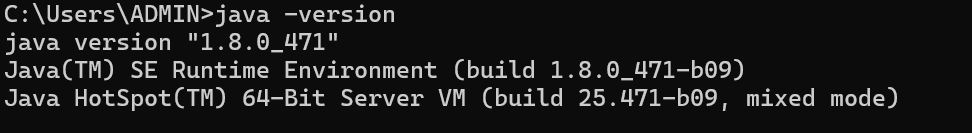

**JDK Version** 


```java
public class HelloWorld {
    public static void main(String[] args) {
        System.out.println("Hello, World!");
    }
}
```
**Full pipeline: Source → Bytecode → Class Loading → Linking → Execution**
1. Compilation (javac)

HelloWorld.java → HelloWorld.class (bytecode, platform-independent).

2. Class Loading

JVM's Class Loader subsystem loads HelloWorld.class into memory.
Three loaders work in a hierarchy (delegation model):

- Bootstrap ClassLoader — loads core JDK classes (java.lang.*, etc.) from rt.jar/module path.
- Platform ClassLoader — loads JDK-specific classes (Java 9+, replaced old "Extension" loader).
- Application ClassLoader — loads your HelloWorld.class from the classpath.


Delegation: each loader asks its parent first before loading itself — prevents core classes from being overridden.

3. Linking (three sub-phases)

- Verification — bytecode verifier checks the .class file is structurally valid, doesn't violate JVM security constraints (no illegal type casts, stack over/underflows, etc.).
- Preparation — JVM allocates memory for static variables and sets them to default values (0, null, false) — actual assignment happens later.
- Resolution — symbolic references (class names, method names, field names) in the bytecode are resolved to direct references (actual memory addresses/pointers). This can happen lazily (on first use) or eagerly, depending on JVM implementation.

4. Initialization

Static initializers and static variable assignments run in order.
For HelloWorld, this step does little since there are no static fields to initialize.

5. Execution

JVM invokes main(String[] args).
Interpreter starts executing bytecode line-by-line immediately.
JIT Compiler monitors execution; if a method is called repeatedly ("hot"), it compiles that method to native machine code and caches it, bypassing the interpreter for future calls.
For Hello, World!, main runs once — interpreter handles the whole thing, JIT never kicks in